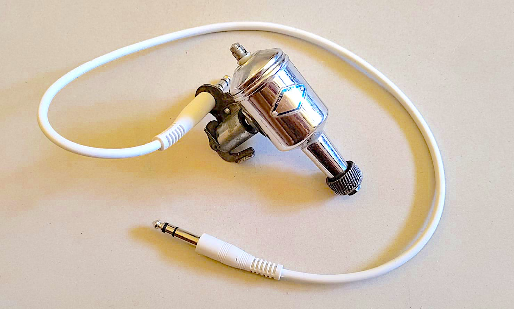
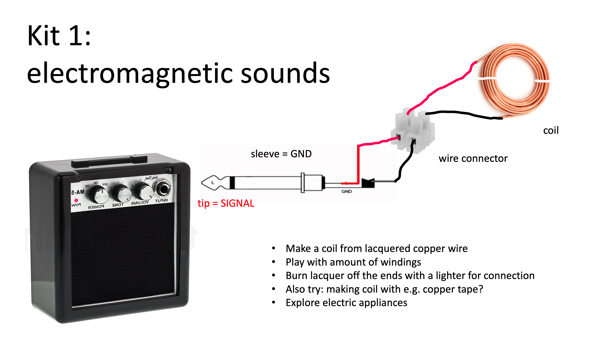
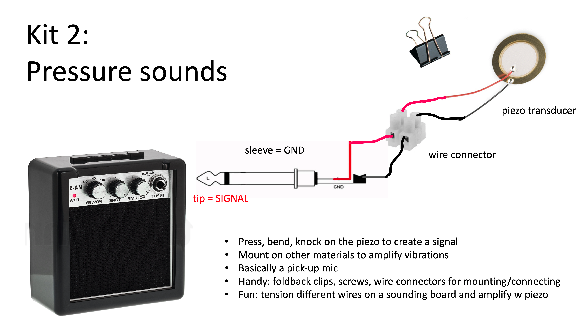
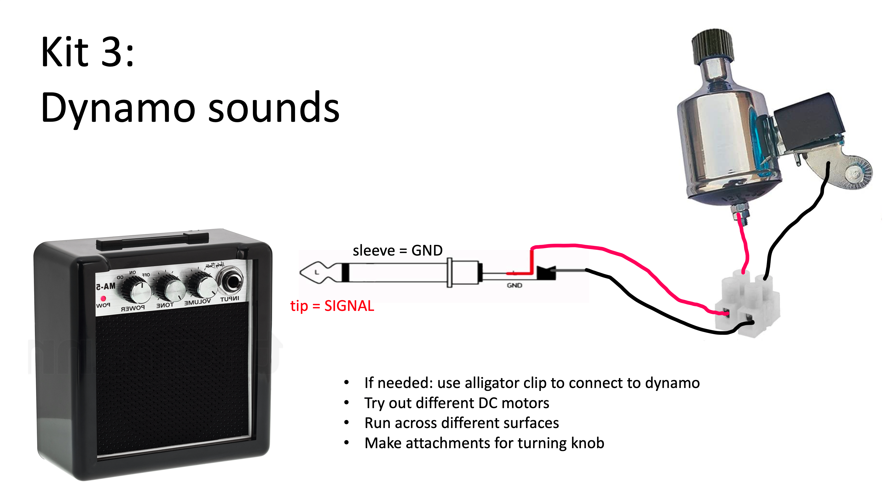
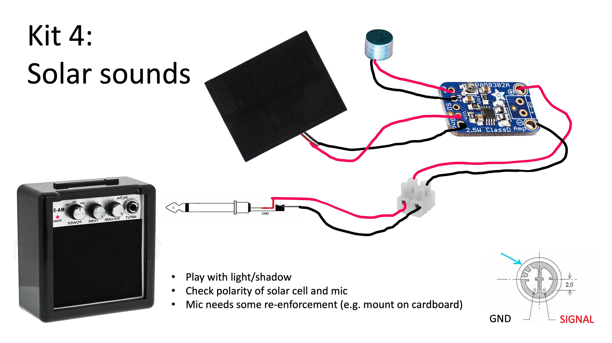

# Hacked Orchestra instructions - HDSC 2023

  


These are the components kits and instructions for the Hacked Orchestra workshop during summer camp 2023. We are highly indebted to Nic Collins' fun experiments from the book [Handmade Electronic Music](https://www.nicolascollins.com/handmade.htm). 

A mini guitar amp is provided with all the kits, this is powered with a 9V battery for the moment. In the future we could try and find ways to power it with renewable energy. 

These are very basic recipes to turn "signals" around us into sound. It's up to you to explore what kind of possible instrument you could make with this and how (and by whom or by what) they should be played. 


**Workshop script**

[https://etherpad.hackersanddesigners.nl/p/hdsc2023_hackedorchestra](https://etherpad.hackersanddesigners.nl/p/hdsc2023_hackedorchestra)

**Materials list**

[Materials list](./files/hackedorchestra_materiaallijst.xlsx)

## Electromagnetic

 With this basic tool you can audio sniff all sorts of sounds from electronic devices. You are capturing a parasitic signal from the electromagnetic fields created by powered devices such as laptops, fridges, routers. 

  

## Pressure  

 With this basic tool you can audio sniff all sorts of sound created by pressure on the piezo disk. This ceramic disk generates small electric pulses when forces is applied to it (e.g. knocking, bending). 

  
 
## Dynamos
 
 With this setup you can use any DC motor to create sounds. A moto spins when you apply power, but the reverse also applies: if you turn a motor shaft you generate a bit of electricity that can be amplified as sound. We salvaged a bunch from bicycle dynamos, toys and sound recorders you can explore. 

  
 
## Solar sounds

This basic tool uses an electret microphone to create signals. These are so small that we need a class D amplifier to make them audible. By powering it directly from a 5V solar cell, playing with light and shadows will give you different sounds. You 

  


## Bonus round: audible networks

Another surrounding physical vibration is that of network traffic. Although invisble, it is possible to guage the presence of this traffic by logging it in the terminal and passing the raw data to an audio player in real time. 

### Requirements
- A computer with a terminal connected to a network.
- The terminal must have two programs installed:
  - [`tcpdump`](https://www.tcpdump.org/) to capture network traffic in real-time. Coes pre-installled on most MacOS and linux-based machines.
  - [`aplay`](hhttps://linux.die.net/man/1/aplay) to play audio. If not installed, could be replaced by `play` or `afplay` or any program that can play it input data as audio.

### Setup
The setup is simple: the computer's local network traffic is captured and passed to an audio player.
```bash
tcpdump -A | aplay -r 512000
```
Explanation of commands and parameters
- `tcpdump`: command to dump network traffic
- `-A`: display network packets' contents as well
- `|`: use the output of the preceding command as the input for the following command
- `aplay`: play the received input as audio
- `-r 512000`: play the data at a sampling rate of 512000 Herz.
But you'd most likely need super-user privileges to capture your network traffic.
```bash
sudo tcpdump -A | aplay -r 512000
```
But we are likely interested in the traffic of only one port: 443, which is the port specific to web traffic. With this command it is specifically interesting to listen to yourself browse the web.
```
 sudo tcpdump port 443 -A |  tee /dev/stderr | aplay -r 512000
```

Go ahead and try to mess around with the different parameters of both programs and see what kind of music you generate!
